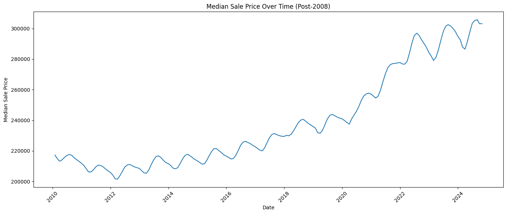
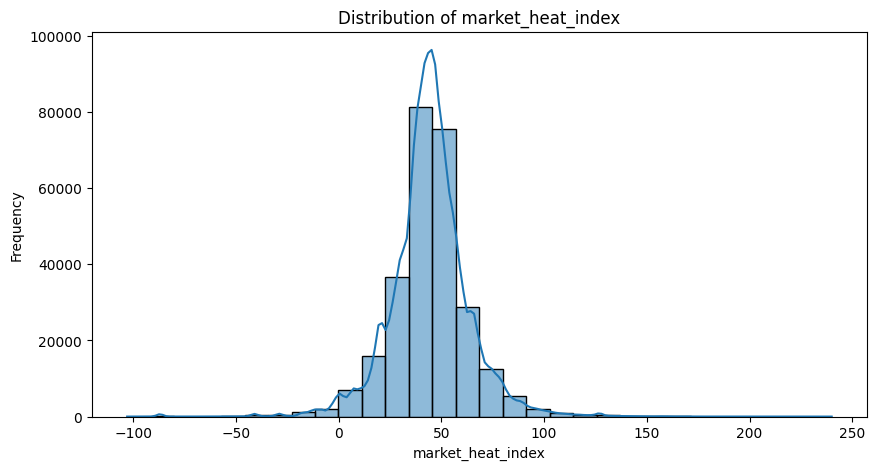
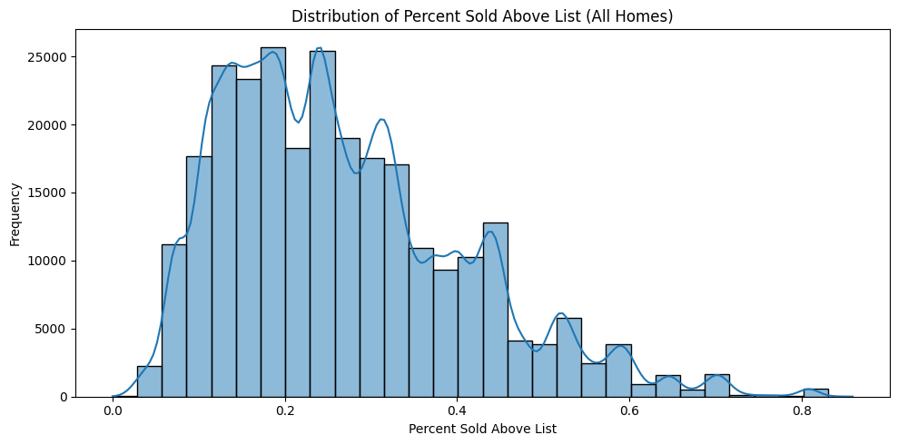
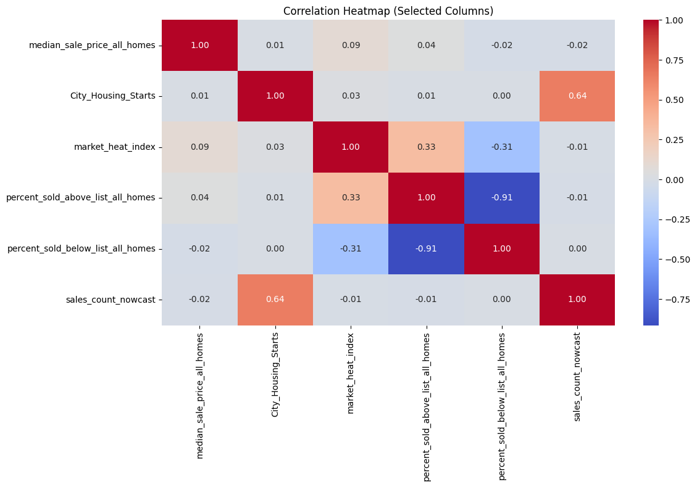

# Effect of New Constructions on House Sale Prices

*"Analyzing Market Dynamics and Price Implications"*

## Presented By
**Team ‘Machine Not Learning’**

## Team Members
- Pranav Dalvi 
- Isha Agarwal 
- Harika Gangu 
- Sukesh Krishna Meda 
- Kushwanth Sai Chandu Meesala
  
## Under the guidance of
Assistant Prof. Joshua Introne

## Introduction
Our project aims to develop a machine learning model that predicts how new constructions impact median house sales prices, specifically focusing on regional effects on housing markets. The primary stakeholders are builders and developers who need precise and actionable insights to optimize their construction planning and pricing strategies effectively. This need is crucial, as the real estate market is sensitive to changes in supply (due to new constructions) and demand. Inaccurate assessments can result in missed opportunities or oversupply, both of which can significantly affect profitability.

Stakeholders need to maximize returns from new projects while ensuring sustainable growth, especially in the face of fluctuating market conditions. Our solution addresses this need by providing dynamic, region-specific predictions through an interactive user interface. This allows stakeholders to make informed decisions that align with current market conditions, maximizing profits and minimizing the risks of market saturation. Our model offers precise predictions by analyzing past construction impacts and current market trends. These insights help stakeholders determine the optimal scale for new projects, adjust pricing models in anticipation of market shifts, and strategically time their market entries or exits based on a thorough analysis of the housing market. Additionally, incorporating various variables and derived features enhances our model's accuracy in assessing market dynamics.

Our project offers a strong model for predicting price impacts from new constructions, but it has limitations in addressing all possible external market influences, such as unexpected economic downturns or policy changes. For example, our current model does not consider sudden economic shifts that could significantly change housing market dynamics. Nonetheless, it represents an incremental step toward developing a more comprehensive predictive tool that can adapt to and integrate broader economic indicators and regional policy changes in future iterations. Continuous improvement is essential as we work to enhance our model's predictive accuracy and its usefulness for stakeholders.

## Literature Review
Current practices in real estate price prediction largely rely on traditional statistical models that focus on broad market trends over time. While these models are useful for identifying general trends, they often fail to capture the subtle effects of new constructions on local housing prices. Additionally, they do not account for non-linear interactions among multiple variables, which are essential for understanding the complex dynamics of the market. These limitations are particularly evident in models used by industry tools like **Zillow**, which, despite providing comprehensive market reports, lack the capacity for location-specific predictions and the ability to dynamically update with new data.

Our review of the existing literature highlights significant gaps in how predictive analytics assess the direct impacts of new constructions on housing prices. For example, **Liang, Lee, and Yong (2020) in their study published in the Journal of Housing and the Built Environment,** discuss the psychological effects of urban renewal on neighborhood housing prices. They suggest that traditional models often overlook these localized impacts. This research emphasizes the need for predictive models that can more accurately forecast responses to localized changes in the housing market. You can access the study here - (https://doi.org/10.1007/s10901-019-09673-z).

Furthermore, broader economic studies available on platforms like EconStor (https://www.econstor.eu/handle/10419/224569) reveal that current models fall short in incorporating the various economic indicators that affect housing markets. This underscores the urgent need for more advanced analytical frameworks. These frameworks should not only integrate different types of data but also adapt dynamically to new information to deliver actionable insights at a detailed level.

By acknowledging these limitations, our project aims to address existing gaps by utilizing advanced machine learning techniques that can process and analyze complex interactions, providing precise and localized predictions for the housing market. We have selected techniques such as **gradient boosting** for their effectiveness in modeling non-linear relationships and interactions among numerous variables. This directly meets the crucial needs of our stakeholders for dynamic and accurate forecasting tools. Our approach is designed to surpass the capabilities of current methodologies by offering a tool that adapts to and incorporates real-time data. This will equip builders and developers with the insights necessary to make informed decisions.

## Data and Methods
### Data
Our dataset was sourced from the 
- US Census Bureau (http://www.census.gov/construction/nrc/index.html) and 
- Zillow Research (https://www.zillow.com/research/data/). 

These sources are well-known for their reliability and thorough coverage of housing market dynamics. The dataset contains metrics on various new constructions, house sales, and market values, providing a solid foundation for analyzing how new constructions impact housing prices. It includes **24 columns** and spans **270,587 rows**, making it a comprehensive dataset suitable for extensive machine learning analysis.

The data includes various features such as total sales, counts of new constructions, and variations in listing prices across multiple regions in the US. This diversity of data points enables a detailed analysis of market dynamics. We have ensured data quality by sourcing information from authoritative sources and conducting preliminary checks to guarantee the integrity and accuracy of the data.

### Methods
Our methodology was carefully designed to navigate the complexities of predicting the impact of new constructions on housing market prices. Below is a detailed breakdown of the steps taken:

#### Data Preprocessing
In the initial phase, we focused on comprehensive data cleaning and preparation. We addressed missing values by using **forward and backward filling** techniques, which were especially effective in preserving accurate temporal sequences in the data, essential for our time series analysis. To mitigate potential scale bias within the dataset, we applied **normalization** and **feature scaling** to all numeric inputs, ensuring that larger-scale variables would not disproportionately affect the model outcomes.

#### Exploratory Data Analysis (EDA)
During our initial exploratory data analysis (EDA), we created visualizations to identify trends and distributions within the data. These visual representations, which are available in our Jupyter notebook, helped us gain insights into underlying patterns and potential biases. A significant finding from our analysis was that we did not observe any substantial patterns linking new constructions to house sale prices. This observation supports the idea that constructors and builders generally respond to demand levels, rarely exceeding them to a degree that would significantly disrupt market dynamics.

Although historical data does not show clear trends, our project aims to explore the close relationship between new construction and house sale prices. By utilizing advanced machine learning techniques, we intend to analyze and quantify even subtle effects that might be overlooked in traditional analyses. This approach highlights our commitment to delivering accurate insights tailored to the unique dynamics of specific markets for our stakeholders.

For exploratory data analysis (EDA), we employed various data visualization tools to plot distributions, detect outliers, and identify patterns. This phase was crucial for feature selection, as it helped us determine which variables had the most significant impact on housing prices. By using correlation matrices and scatter plots, we assessed the interactions between variables and explored how regional differences might influence market dynamics.

#### Median Sale Price Over Time

This graph illustrates the trends in median sale prices post-2008, indicating substantial growth in housing prices over the years.

#### Distribution of Market Heat Index

The market heat index distribution reveals overall market conditions, showing periods of higher and lower activity.

#### Distribution of Percent Sold Above List Price

This histogram displays the frequency distribution of homes sold above the list price, indicating periods of high demand.

#### Correlation Heatmap

The correlation heatmap illustrates the relationships among various market factors, which are essential for understanding the determinants of house pricing.

#### Model Development
Our approach to model development was both iterative and exploratory:
- **Initial Model Trials:** We started with simpler models, such as **linear regression**, to establish a baseline understanding of the data. However, we quickly realized that these models were insufficient for capturing the dataset's complexity, especially in modeling non-linear relationships.
- **Advanced Machine Learning Models:** We then shifted our focus to more advanced models that could handle complex interactions, specifically **XGBoost, Random Forest, and Gradient Boosting.** These models were selected for their ability to manage non-linear data and their effectiveness in performing feature importance evaluations.
- **Target Variable Specification:** We clearly defined our target variable as the **'median_sale_price_all_homes.'** By concentrating on this specific indicator, we ensured that our modeling efforts were directly aligned with the key outcomes important to our stakeholders.
- **Hyperparameter Tuning:** To further refine our models, we conducted extensive hyperparameter tuning using grid search techniques. This allowed us to identify the optimal settings for each model, ultimately enhancing their predictive accuracy and generalization capabilities.
- **Cross-Validation:** To prevent overfitting and assess the generalizability of our models, we utilized cross-validation techniques. This process involved repeatedly splitting the data into training and testing subsets, ensuring that our models were evaluated across various segments of the data.

## Results
Our comprehensive evaluation of different machine learning models, including XGBoost, Random Forest, and Gradient Boosting, has provided significant insights into predicting the effects of new constructions on housing prices. Among these models, XGBoost stood out as the best performer, demonstrating a strong ability to manage complex non-linear relationships in our dataset.

### Model Performance
- **XGBoost** achieved impressive results, recording a **Mean Absolute Error (MAE) of $35,781.40,** which reflects a high level of predictive accuracy in monetary terms. Additionally, the model reached an **R² (Coefficient of Determination) of 0.8612,** indicating a strong fit and the ability to explain a significant portion of the variance in housing prices.

- Random Forest demonstrated commendable performance with an **MAE of $17,266.82** and an **R² of 0.8769,** further solidifying its utility in our predictive framework.

### Feature Importance Analysis
Our analysis using SHAP values showed that factors like new construction counts and market heat indexes play crucial roles in influencing housing prices. The SHAP summary plot (included in the **shap_analysis.ipynb** notebook)  visually highlights the impact of these features. Higher values of these factors significantly drive the model's predictions, reflecting the real-world dynamics observed in housing markets.

### Prototype Development
- To translate our model's capabilities into a practical application, we developed a  **Real Estate Price Prediction Dashboard.** This interactive dashboard allows users to select a prediction model, choose a city, and specify additional housing units to see their impact on prices in real-time.

- The dashboard is user-friendly and accessible through a local server, enabling the immediate application of our predictive models in real-world scenarios.

### Accessibility and Deployment
The trained models, including XGBoost and Random Forest, have been saved as **pickle files,** to ensure they are ready for deployment. The application's code, which enables the interactive dashboard, is included in the project folder for easy access. This code can be run to launch the dashboard directly for interactive use.

### Evaluation Methodology
We evaluated our models using a train-test split to ensure robustness and validate their generalizability. To assess model performance, we calculated the **Mean Absolute Error (MAE)** and the **Coefficient of Determination (R²)**, which helped us determine accuracy and model fit. While this iteration did not include detailed cross-validation, our diverse dataset supports performance evaluation across various market conditions. We plan to incorporate rigorous cross-validation in future updates to enhance the model’s reliability.

### Further Insights and Resources
Further results, detailed visualizations, and comprehensive analysis are available in our Jupyter notebooks located in the project directory. These resources offer deeper insights into our data processing, model training, and evaluation stages, ensuring transparency and enhancing educational value.

## Discussion
Our project focused on developing predictive models to evaluate the impact of new constructions on median house sale prices. This issue is particularly important for stakeholders such as developers, investors, and urban planners. We employed models like XGBoost and Random Forest, which effectively captured the overall trends and effects of new constructions on housing markets. Our models achieved a high degree of accuracy, as indicated by the Mean Absolute Error (MAE), and demonstrated a good fit with a strong R² value. Overall, we successfully met the technical objectives established at the beginning of the project.

However, the project's success in meeting stakeholder needs is mixed. While we offer valuable insights into regional market dynamics, our tool's lack of hyper-localized predictions means it may not fully satisfy the specific decision-making requirements of local developers and real estate professionals. This limitation arises from the models' inability to consider localized factors, such as neighborhood-specific economic conditions and zoning laws, which can significantly affect housing prices.

## Limitations
- **Data Quality & Availability:** Our reliance on limited Zillow data restricted our analysis to broader regional insights instead of providing detailed local predictions. By expanding our data sources, we could achieve more precise, localized forecasts.
- **Missing Data Challenges:** Significant gaps in our data could introduce biases. Utilizing advanced imputation techniques may help address these gaps and improve the overall integrity of the data.
- **Computational Constraints:** Limited computational resources hindered our ability to use complex models, such as deep learning, which could effectively capture nuanced patterns.
- **Generalization Concerns:** There is a risk of overfitting, raising concerns about the generalizability of our models. Implementing robust validation methods, particularly for time-series data, could improve their reliability.
- **Inadequate Stakeholder Solutions:**  Our current models do not fully meet the needs of stakeholders who require detailed, neighborhood-level predictions. Future efforts should incorporate more granular demographic and economic data.
- **Quality of Results:** Our reliance on traditional metrics without external validation may limit the real-world applicability of our results. Testing our models against external datasets is essential for confirming their validity.

## Future Work
While our current project provides valuable insights into the impact of new constructions on housing prices, several areas warrant further exploration and enhancement.

- **Regional Segregation by Urbanization Levels:** To enhance the model's predictive accuracy, we aim to categorize regions based on their urban, rural, or medium-density classifications. By tailoring our analysis to these distinct contexts, we can gain a better understanding of the specific dynamics within each housing market and develop more accurate predictions. This stratification will also help us refine the model’s recommendations for stakeholders operating in various regional contexts.
- **Enhanced UI Dashboard Features:** Our dashboard currently offers essential functionality for analyzing real estate price trends related to a specific number of new constructions in a particular region. In the future, we plan to add more features to provide a comprehensive suite of tools for stakeholders. These enhancements may include detailed metrics on regional performance, trend analysis, and comparative insights to facilitate more strategic decision-making.
- **Broader Data Integration:** Future iterations will include additional data points, such as economic indicators, policy changes, and housing affordability indices, to enhance the model's robustness. By integrating a wider range of datasets, the model will be able to adjust to external market conditions and offer stakeholders a more nuanced perspective on market trends.
- **Dynamic Model Updates:** A major limitation of our current approach is its static nature. Future work will aim to develop a dynamic learning framework that updates the model in real-time with incoming data, ensuring predictions remain accurate as market conditions change.
- **Extended Validation Across Regions:** Although our results show strong model performance, we intend to broaden our validation efforts across various regions and economic conditions. This will assess the model’s generalizability and reliability in different scenarios.

By focusing on these areas, we aim to improve our model's utility and relevance, ensuring it continues to meet the dynamic needs of stakeholders in the real estate market.

## Conclusion
Our project marks a significant advancement in using machine learning to understand and predict how new constructions impact housing prices. The models created through this initiative offer stakeholders valuable tools for forecasting and planning for market changes. However, there is still room for improvement regarding data granularity and model complexity. Ongoing development and refinement of these tools will be essential to ensure their continued usefulness in a rapidly evolving market landscape.

